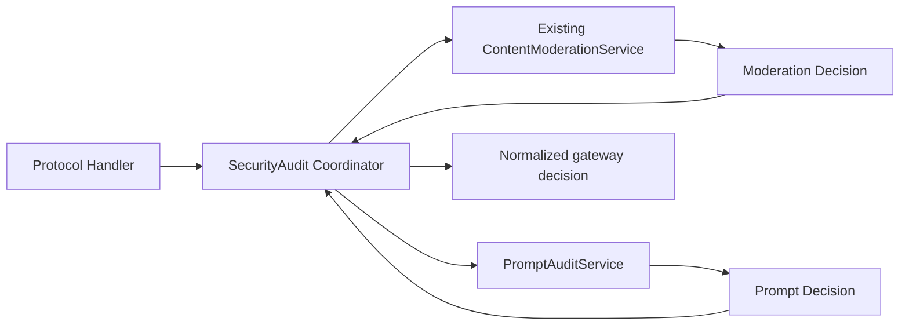

## Context

### 当前系统

sub2api 当前已经存在一套完整的内容审核能力：

- 核心实现位于 `backend/internal/service/content_moderation*.go`。
- 管理 API 位于 `backend/internal/handler/admin/content_moderation_handler.go`，路由前缀为 `/admin/risk-control`。
- 网关统一接线位于 `backend/internal/handler/content_moderation_helper.go`，各协议 Handler 在解析完请求体和模型后调用 `checkContentModeration`。
- 数据保存在 `content_moderation_logs`，配置保存在 settings 的 `content_moderation_config`。
- 管理页面为 `frontend/src/views/admin/RiskControlView.vue`。
- 能力包括 OpenAI Moderations、关键词阻断、命中 Hash、异步观察、同步前置阻断、API Key 健康、邮件、违规计数和自动封号。

该能力不是本次要迁移的 aicodex-api “提示词审计”：两者使用不同模型、分类、队列、事件和阻断语义。把 Qwen3Guard 直接塞入 ContentModerationService 会让现有阈值、封号统计和记录含义失真，也会继续扩大已经接近 3000 行的单文件。

### 参考能力

参考仓库 `/Users/mt/code/mt-ai/aicodex/aicodex-api` 当前磁盘实现提供：

- OpenAI 兼容 Qwen3Guard 审计池。
- 持久 PromptAuditJob / PromptAuditEvent。
- Redis 30 分钟临时原文载荷。
- 进程内 Worker、重试、租约和滞留回收。
- 脱敏快照、Hash、Unicode 分片、最新输入优先。
- 九类风险和严格 `Safety/Categories` 解析。
- 异步审计与同步 fail-closed 阻断。
- HTTP、SSE、Responses WebSocket 错误映射。
- 节点探测、运行态、事件筛选/详情/硬删除和独立控制台页面。

参考仓库 `yjb` 分支当前包含未提交的同步阻止改动。因此实施开始前必须固定源 commit/tag 或生成包含未提交文件的只读 patch 清单，作为功能对照和测试移植的权威基线。

### 目标项目约束

- PostgreSQL SQL migrations 是 schema 的事实源，Ent 自动迁移不是生产建表入口。
- 后端是 Go + Gin + Wire；前端是 Vue 3 + TypeScript + pnpm。
- Redis 已是运行基础设施，可作为短 TTL 敏感载荷存储和配置失效通知通道。
- 新模块必须尽量集中在独立目录，并只通过显式接口接入现有 Handler。
- 新功能默认关闭，不能改变升级前行为。
- 完整提示词和 Guard 凭据不能进入数据库、日志、API、前端或错误响应。

### 参与边界

- 网关请求处理：提供可信身份上下文、协议、模型和原始请求体。
- 安全审计协调器：调用两个独立引擎并归并阻断结果。
- 现有内容审核：保持原实现和副作用。
- 新 Prompt Audit 模块：负责配置、提取、队列、Guard、事件、运行态和管理 API。
- PostgreSQL：持久任务与事件。
- Redis：扫描正文 TTL、配置失效通知、可选跨实例心跳/指标汇总。
- 控制台：独立提示词审计页面。

## Goals / Non-Goals

**Goals:**

- 在不改变现有内容审核语义的前提下完整引入提示词输入审计。
- 使用模块化垂直目录封装新能力，限制对现有代码的修改面。
- 保持所有现有 OpenAI/Claude/Gemini/媒体兼容入口的请求和响应 envelope。
- 提供异步不阻塞和同步 fail-closed 两种模式。
- 在同步 Block/Unavailable 时保证无账号、无计费、无上游副作用。
- 支持多实例持久任务消费和配置最终一致。
- 只持久化脱敏、可关联、可复核的数据。
- 把运行态、日志、指标和测试设计为第一等反馈信号。
- 提供完整、独立、可访问的管理页面。

**Non-Goals:**

- 不审核模型输出，不在流式输出中途截断。
- 不实现请求正文 Redact 或自动改写。
- 不实现人工审批、申诉、逐请求放行或策略工作流。
- 不把 Qwen3Guard 分类映射为现有 OpenAI Moderations 分数。
- 不让提示词审计命中触发自动封号、邮件或 Hash 黑名单。
- 不删除、合并或迁移 `content_moderation_logs`。
- 不新增目标项目不存在的 AICodex 专属产品路由；只对目标项目实际存在的文本入口提供等价覆盖。
- 不在本 change 中重构整个 Handler、计费或账号调度架构。

## Decisions

### 1. 迁移行为契约，而不是直接复制源目录

源模块依赖 aicodex-api 的 Ent 全局客户端、option 模型、Gin context key、日志封装、Caddy/gatewaycore 和 React 控制台，不能原样复制到目标项目。

实施时以本 change 的 specs 和验收矩阵作为权威行为契约，再选择目标项目已有的 SettingRepository、Redis、SecretEncryptor、Gin Handler、SQL migration 和 Vue 组件实现。

**备选方案：直接复制 `internal/service/promptaudit`。** 放弃，因为会引入大量适配壳、全局状态和源仓库私有依赖，并且源工作区当前未提交。

### 2. 使用模块化垂直目录承载新能力

新增目录：

```text
backend/internal/securityaudit/
├── coordinator.go
├── prompt_config.go
├── prompt_types.go
├── prompt_snapshot.go
├── prompt_scanner.go
├── prompt_qwen3guard.go
├── prompt_outbound_security.go
├── prompt_repository.go
├── prompt_payload_store.go
├── prompt_enqueue.go
├── prompt_worker.go
├── prompt_guard.go
├── prompt_runtime.go
├── prompt_handler.go
├── prompt_logging.go
├── prompt_module.go
└── *_test.go
```

该目录内部允许用文件划分子职责，但对外只暴露：

- `Coordinator.Check(ctx, Request) Decision`
- `PromptService` 生命周期与管理方法
- `PromptAdminHandler`
- Wire provider set

SQL migration、前端和少量路由/注入接线由于项目结构约束仍位于各自事实源目录。

**备选方案：继续平铺在 `internal/service`、`internal/repository` 和 `internal/handler`。** 放弃，因为无法满足独立模块要求，也会增加 AI 和人工定位所需上下文。

### 3. 使用薄协调器组合两个引擎

目标调用关系：



Coordinator 只承担：

1. 接收可信身份和请求快照。
2. 确保新异步任务即使现有引擎随后阻断也能 best-effort 投递。
3. 在新同步模式下执行两个引擎并等待结果。
4. 使用固定优先级生成客户端决策。

优先级：

1. 现有内容审核 Block：保留原状态、错误码和文案。
2. Prompt Guard Block：403 + `prompt_guard_blocked`。
3. Prompt Guard Invalid：503 + `prompt_guard_invalid_response`。
4. Prompt Guard Unavailable：503 + `prompt_guard_unavailable`。
5. 否则 Allow。

两个引擎的事件和副作用独立。Coordinator 不持久化业务事件，不修改风险分数。

**同步执行策略：** 当 Prompt Guard blocking 开启时，现有内容审核和 Prompt Guard 可在独立受控 goroutine 中并行执行，共享请求取消信号但不共享 mutable state。必须等待两者完成或各自 deadline 到期，以保留两个引擎的审计完整性。若实现评审认为并行引入的复杂度过高，可先串行执行，但仍必须满足既有 Block 响应优先级和无下游副作用测试。

### 4. 复用现有接入位置，但显式改名为安全审计

把各协议 Handler 的 `checkContentModeration` 调用机械替换为 `checkSecurityAudit`，保持调用点仍在：

- 身份鉴权、基本请求体读取和协议格式校验之后。
- 账号选择、账户并发、计费资格、预扣、上游拨号/写入之前。

现有 `content_moderation_helper.go` 改为或新增 `security_audit_helper.go`，构造统一 `securityaudit.Request`：

```go
type Request struct {
    RequestID  string
    UserID     int64
    Username   string
    UserEmail  string
    APIKeyID   int64
    APIKeyName string
    GroupID    *int64
    GroupName  string
    Provider   string
    Endpoint   string
    Protocol   string
    Model      string
    Body       []byte
    Stage      string // http, first_turn, subsequent_turn
}
```

请求体必须在 Handler 已受全局大小限制后传入。模块不得再次从 `http.Request.Body` 读取，避免破坏转发。

### 5. 保持三个独立开关层级

有效开关：

1. `risk_control_enabled`：现有安全审计总入口和菜单开关。
2. `content_moderation_config.enabled/mode`：现有内容审核。
3. `prompt_audit_config.enabled/blocking_enabled`：新提示词审计。

Prompt Audit 有效模式：

| risk_control | enabled | blocking_enabled | 有效行为 |
| --- | --- | --- | --- |
| false | 任意 | 任意 | off |
| true | false | false | off |
| true | true | false | async_audit |
| true | true | true | blocking |

后端必须拒绝 `enabled=false && blocking_enabled=true`。前端联动只提升体验，不能替代后端校验。

### 6. 配置使用 settings JSON，但凭据独立加密

新增 setting key：`prompt_audit_config`。

配置结构包含：

```text
enabled
blocking_enabled
store_pass_events
strategy=priority
worker_count
queue_capacity
scanners[]
all_groups
group_ids[]
config_version
updated_at
updated_by
change_summary
endpoints[]
```

每个 endpoint 持久化：

```text
id, name, protocol=openai_compatible, base_url, model,
token_ciphertext, timeout_ms, input_limit, enabled
```

读取 API 只返回 `has_token`/`token_status`。保存请求使用：

- `token` 非空：替换并加密。
- `token` 空且 `clear_token=false`：保留已有密文。
- `clear_token=true`：删除密文。

config_version 每次成功保存单调加一。change_summary 只保存节点数量、开关、分类数量、分组数量及其 Hash 等脱敏摘要。

保存请求必须携带管理员读取草稿时的 `expected_config_version`。ConfigStore 在 PostgreSQL 短事务中获取 `prompt_audit_config` 专用 advisory transaction lock，重新读取 settings 当前值并比较版本；不一致时返回 409 `prompt_audit_config_conflict`，不得覆盖其他管理员的新配置。版本一致时才计算 current+1、加密并写回。首次无 setting 时按 version=1/default-off 参与比较。进程内 mutex 不能代替该多实例 CAS。

**备选方案：新增配置表。** 第一版放弃，因为目标项目已有 settings 配置模式，源实现也使用 option JSON；任务和事件才需要独立关系表。

### 7. 配置使用内存快照和 Redis 失效通知

PromptService 维护原子只读配置快照：

- 启动时加载并校验。
- 保存成功后先安装本实例快照，再 publish `sub2api:prompt_guard:config:invalidate`，消息只包含版本。
- 其他实例收到通知后重新从 settings 加载、解密、校验并原子替换。
- Redis publish 失败时保留最后有效配置，并通过 5 秒有界 TTL 后台刷新。
- 请求热路径只读取快照，不查询数据库。

运行态返回 expected 和 active version。配置加载失败不得清空最后有效快照；冷启动无有效快照时不得伪装为关闭或健康。

### 8. 使用提示词专用快照提取器，不直接复用现有截断结果

复用现有内容审核提供的 protocol 常量、身份/分组上下文和部分 JSON 内容块解析思路，但新模块实现独立 `PromptSnapshotExtractor`：

- Chat Completions：只提取 role=user 的文本内容。
- Responses：支持 input 字符串、消息数组和 content blocks。
- Claude Messages：提取 role=user 文本块。
- Gemini：提取 user contents/parts 文本。
- Images/媒体：只提取 prompt 文本，忽略图片载荷。
- Responses WS：解析每个 response.create 帧。

扫描顺序：

1. 最新非空用户输入独立作为首段。
2. 其余用户历史保持确定顺序。
3. 每段再按 Unicode rune 分片。

数据库预览使用统一脱敏器：移除/掩码 API Key、Bearer、常见凭据、邮箱/电话等敏感模式，随后按 rune 裁剪。Hash 使用实际待扫描文本的 SHA-256。

### 9. PostgreSQL 使用两个新表，SQL migration 为事实源

建议 migration 名称：`backend/migrations/181_prompt_audit.sql`。如果实施时已有 181，则按当前最大序号递增，不允许修改已应用 migration。

#### `prompt_audit_jobs`

```sql
CREATE TABLE prompt_audit_jobs (
    id                    BIGSERIAL PRIMARY KEY,
    request_id            VARCHAR(128) NOT NULL DEFAULT '',
    user_id               BIGINT REFERENCES users(id) ON DELETE SET NULL,
    username_snapshot     VARCHAR(255) NOT NULL DEFAULT '',
    user_email_snapshot   VARCHAR(320) NOT NULL DEFAULT '',
    api_key_id            BIGINT REFERENCES api_keys(id) ON DELETE SET NULL,
    api_key_name_snapshot VARCHAR(255) NOT NULL DEFAULT '',
    group_id              BIGINT REFERENCES groups(id) ON DELETE SET NULL,
    group_name            VARCHAR(255) NOT NULL DEFAULT '',
    provider              VARCHAR(64) NOT NULL DEFAULT '',
    endpoint              VARCHAR(128) NOT NULL DEFAULT '',
    protocol              VARCHAR(64) NOT NULL DEFAULT '',
    model                 VARCHAR(255) NOT NULL DEFAULT '',
    prompt_hash           VARCHAR(64) NOT NULL DEFAULT '',
    redacted_preview      TEXT NOT NULL DEFAULT '',
    prompt_length         INT NOT NULL DEFAULT 0,
    message_count         INT NOT NULL DEFAULT 0,
    execution_mode        VARCHAR(32) NOT NULL DEFAULT 'async_audit',
    config_version        BIGINT NOT NULL DEFAULT 1,
    status                VARCHAR(32) NOT NULL DEFAULT 'staging',
    attempts              INT NOT NULL DEFAULT 0,
    max_attempts          INT NOT NULL DEFAULT 3,
    claim_version         BIGINT NOT NULL DEFAULT 0,
    next_attempt_at       TIMESTAMPTZ NOT NULL DEFAULT NOW(),
    processing_started_at TIMESTAMPTZ,
    processed_at          TIMESTAMPTZ,
    last_error_code       VARCHAR(64) NOT NULL DEFAULT '',
    last_error_message    TEXT NOT NULL DEFAULT '',
    created_at            TIMESTAMPTZ NOT NULL DEFAULT NOW(),
    updated_at            TIMESTAMPTZ NOT NULL DEFAULT NOW()
);
```

状态集合：`staging|queued|processing|retry|done|failed`。

关键索引：

```text
(status, next_attempt_at, id)
(request_id)
(user_id, created_at DESC)
(api_key_id, created_at DESC)
(group_id, created_at DESC)
(prompt_hash)
(created_at DESC)
```

#### `prompt_audit_events`

```sql
CREATE TABLE prompt_audit_events (
    id                       BIGSERIAL PRIMARY KEY,
    job_id                   BIGINT NOT NULL REFERENCES prompt_audit_jobs(id) ON DELETE CASCADE,
    request_id               VARCHAR(128) NOT NULL DEFAULT '',
    user_id                  BIGINT REFERENCES users(id) ON DELETE SET NULL,
    username_snapshot        VARCHAR(255) NOT NULL DEFAULT '',
    user_email_snapshot      VARCHAR(320) NOT NULL DEFAULT '',
    api_key_id               BIGINT REFERENCES api_keys(id) ON DELETE SET NULL,
    api_key_name_snapshot    VARCHAR(255) NOT NULL DEFAULT '',
    group_id                 BIGINT REFERENCES groups(id) ON DELETE SET NULL,
    group_name               VARCHAR(255) NOT NULL DEFAULT '',
    provider                 VARCHAR(64) NOT NULL DEFAULT '',
    endpoint                 VARCHAR(128) NOT NULL DEFAULT '',
    protocol                 VARCHAR(64) NOT NULL DEFAULT '',
    model                    VARCHAR(255) NOT NULL DEFAULT '',
    prompt_hash              VARCHAR(64) NOT NULL DEFAULT '',
    redacted_preview         TEXT NOT NULL DEFAULT '',
    decision                 VARCHAR(32) NOT NULL DEFAULT 'pass',
    risk_level               VARCHAR(32) NOT NULL DEFAULT 'low',
    action                   VARCHAR(32) NOT NULL DEFAULT 'Allow',
    categories               JSONB NOT NULL DEFAULT '[]'::jsonb,
    matched_scanners         JSONB NOT NULL DEFAULT '[]'::jsonb,
    scanner_scores           JSONB NOT NULL DEFAULT '{}'::jsonb,
    scanner_evidence         JSONB NOT NULL DEFAULT '{}'::jsonb,
    scanner_backend          VARCHAR(64) NOT NULL DEFAULT 'qwen3guard-openai',
    scanner_version          VARCHAR(128) NOT NULL DEFAULT '',
    guard_endpoint_id        VARCHAR(128) NOT NULL DEFAULT '',
    policy_id                VARCHAR(128) NOT NULL DEFAULT '',
    policy_version           INT NOT NULL DEFAULT 0,
    config_version           BIGINT NOT NULL DEFAULT 1,
    chunk_total              INT NOT NULL DEFAULT 0,
    latency_ms               INT NOT NULL DEFAULT 0,
    created_at               TIMESTAMPTZ NOT NULL DEFAULT NOW()
);
```

事件保留请求快照列用于稳定查询，即使 user/API key/group 后续删除仍保留管理员可复核上下文。用户名、邮箱和 API Key 名称必须作为不同字段返回，不能拼成不可筛选的单一展示串；这些身份快照沿用现有管理员数据访问和保留规则，不得写入普通请求日志。外键使用 SET NULL，快照字段保留。

事件索引：job、request、decision/time、risk/time、user/time、API key/time、group/time、Hash、created_at。

不得创建 raw_prompt、raw_request、payload、token 等列。

### 10. 跨 PostgreSQL/Redis 投递使用 staging 状态避免竞态

异步投递顺序：

1. 检查有效模式、范围和节点；在 PostgreSQL 短事务内获取 Prompt Audit 队列准入 advisory transaction lock，重新统计 active jobs，并仅在低于 snapshot queue_capacity 时插入 staging job。
2. 提取快照。
3. 插入 `status=staging` 的 job。
4. `SET sub2api:prompt_audit:payload:<job_id> <scan_text> EX 1800`。
5. 条件更新 staging → queued。
6. 输出 `prompt_audit.job_enqueued`。

Worker 只领取 queued/retry，因此不会在 Redis SET 前看到任务。

失败处理：

- 步骤 3 失败：不写 Redis。
- 步骤 4 失败：job → failed，原请求继续。
- 步骤 5 失败：删除 Redis key；job 由 staging 清理器标记 failed。
- 进程在 4/5 之间退出：Redis 自动过期，staging 回收器标记 failed。

这比源实现“先 queued 再写 Redis”更适合多实例，避免 Worker 提前领取。

队列容量检查和 staging INSERT 必须在同一准入锁事务中完成，防止多个实例先各自看到剩余容量再共同超限。锁等待必须有很短的有界 timeout；无法及时取得锁时按 `queue_admission_busy` 丢弃异步审计任务并让主请求继续。Redis 写入不在该事务内。

### 11. Worker 使用 PostgreSQL 原子领取与租约

Repository 使用短事务：

```sql
WITH candidate AS (
    SELECT id
    FROM prompt_audit_jobs
    WHERE status IN ('queued', 'retry')
      AND next_attempt_at <= NOW()
    ORDER BY next_attempt_at, id
    FOR UPDATE SKIP LOCKED
    LIMIT 1
)
UPDATE prompt_audit_jobs j
SET status = 'processing',
    attempts = attempts + 1,
    claim_version = claim_version + 1,
    processing_started_at = NOW(),
    updated_at = NOW()
FROM candidate
WHERE j.id = candidate.id
RETURNING j.*;
```

Worker 必须把 RETURNING 得到的 `claim_version` 作为 fencing token 保存到本次执行上下文。每处理一个分片前以 `id + status=processing + claim_version` 条件更新 `processing_started_at`；创建事件、标记 done/retry/failed 同样必须校验 claim_version 并检查 affected rows。回收后再次领取会递增版本，因此旧 Worker 即使稍后恢复也不能覆盖新领取者的结果。

回收器每分钟扫描一小批超时 processing：

- attempts < max_attempts → retry。
- attempts >= max_attempts → failed。

退避建议：5s、30s、2m，上限 5m并加少量 jitter。401/403 和 invalid_response 不重试；429、5xx、连接错误和超时可重试。

Runner 生命周期由应用启动/停止管理：

- Start 验证 DB、Redis、配置。
- Worker panic 单任务恢复并记录，不能杀死进程。
- Shutdown 停止领取新任务，等待活动任务到有界超时。

### 12. OpenAI 兼容 Client 使用严格 Qwen3Guard 契约

请求：

```json
{
  "model": "sileader/qwen3guard:0.6b",
  "messages": [{"role": "user", "content": "<chunk>"}],
  "temperature": 0,
  "max_tokens": 64,
  "seed": 42
}
```

解析要求：

- 响应体上限 256 KiB。
- 只接受一个非空 `Safety:` 行和一个 `Categories:` 行。
- 只接受 Safe、Controversial、Unsafe。
- 不允许额外非空说明。
- 类别做大小写/标点别名归一，但未知类别必须保留风险事实。

策略映射：

| Safety | 已启用类别 | 结果 |
| --- | --- | --- |
| Safe | 任意 | Pass / Allow |
| Controversial | 普通类别 | Flag / Warn |
| Controversial | Jailbreak/PII/Suicide & Self-Harm | Critical / Block |
| Unsafe | 至少一个启用类别 | Critical / Block |
| Unsafe | 未知类别 | Critical / Block + unknown_unsafe |
| Unsafe | 仅命中明确禁用类别 | Flag / Warn，保留事实 |

scanner score 只用于展示排序，不得被解释为真实置信度阈值。

管理 API 还应从 categories、scanner evidence 和 Guard policy 确定性派生 `issue_summaries`。每项至少包含 category、scanner_id、title、description、severity/label、action/label、code、score 和脱敏 evidence；可选位置必须是 rune 范围和不可逆命中 Hash，不能返回原文。该摘要是展示 DTO，不要求新增数据库列，防止复制同一风险事实。

### 13. 同步 Guard 使用共享 deadline、故障切换和 bulkhead

同步 evaluator：

- 全局并发上限默认 64。
- 每节点并发上限默认 16。
- 总 deadline 使用第一启用节点 timeout。
- 所有分片和节点故障切换共享 deadline。
- 顺序扫描，最新输入优先。
- Block 可早停；Allow 必须所有必要分片成功。
- 连接失败、429、5xx、超时可切下一节点。
- 401/403、invalid_response 终止。
- 所有节点失败或 bulkhead 满 → Unavailable。

第一版不使用熔断器外部依赖；连续失败健康状态和冻结窗口可用模块内小状态机实现。若后续数据证明需要通用熔断库，另起 change。

### 14. 出站 HTTP Client 使用管理员配置的网络目标

保存、探测和实际调用共用同一校验：

- 仅接受结构有效的 http/https Base URL，并禁止会破坏固定 API 路径拼接的 userinfo、query、fragment。
- 私网、回环、link-local、metadata、保留地址及域名解析结果均不做目标类别拦截。
- HTTP 与 HTTPS 均可由管理员选择；使用标准 DialContext 和标准重定向行为。
- 节点目标的可信性、网络可达性和协议安全由管理员负责。
- 独立连接池、Dial/TLS/Header timeout、响应上限。
- 日志只记录 endpoint ID，不记录完整 URL。

### 15. HTTP、SSE 和 WebSocket 使用协议原有错误构造器

HTTP 错误：

| 情况 | HTTP | error_code |
| --- | ---: | --- |
| Block | 403 | prompt_guard_blocked |
| Unavailable | 503 | prompt_guard_unavailable |
| Invalid response | 503 | prompt_guard_invalid_response |

Handler 使用自己已有的 OpenAI、Claude 或 Gemini error helper。正文只包含通用中文消息、code 和 request ID。

现有 helper 需要通过最小协议适配器扩展稳定代码，不能破坏原字段：

- OpenAI Chat/Responses：保持 `error.type/message` 或 Responses 现有结构，并设置 `error.code=<prompt_guard_*>`。
- Claude Messages：保持 `type=error` 和合法的 `error.type=permission_error|api_error`，增加可选 `error.code=<prompt_guard_*>`。
- Gemini：保持 Google envelope 的数值 `error.code`、message 和 canonical status；在 `error.details[]` 增加 `type.googleapis.com/google.rpc.ErrorInfo`，其 `reason=<prompt_guard_*>`、domain=`sub2api.securityaudit`，metadata 只允许 request_id。

不得把 Gemini 数值 `error.code` 替换为字符串，也不得把类别、Prompt、节点或内部错误放入 details。协议 golden test 必须锁定三类 envelope。

SSE 必须在 Guard 完成前不写 response header/首字节。

Responses WebSocket：

- 握手本身无 prompt，不执行输入分类。
- 首个 response.create 在用户/账号 slot、计费和上游拨号前检查。
- 每个后续 response.create 在本轮 slot、计费和上游发送前重新检查。
- Block：close 4403，reason prompt_guard_blocked。
- Unavailable/Invalid：close 1013，对应稳定 reason。
- 日志 stage=first_turn/subsequent_turn。

### 16. 同步结果采用独立轻量记录路径

同步 evaluator 返回：

```text
decision, action, risk_level, categories,
matched_scanners, scores, evidence,
scanner_backend/version, endpoint_id,
policy_id/version, chunk_total, latency,
error_code, allow_next_stage
```

记录 adapter：

- 不接受完整 scan_text，只接受脱敏 PromptSnapshot。
- 创建 `execution_mode=blocking,status=done` 的 job。
- 按 store_pass_events 决定是否创建事件。
- 在单个 DB transaction 内完成 job + event。
- 记录失败只增加指标和日志，不改变 evaluator 已确定结果。
- 禁止再次调用 Guard。

### 17. 管理 API 使用独立前缀和现有管理员审计

新增：

```text
GET    /admin/prompt-audit/config
PUT    /admin/prompt-audit/config
POST   /admin/prompt-audit/endpoints/probe
GET    /admin/prompt-audit/runtime
GET    /admin/prompt-audit/events
GET    /admin/prompt-audit/events/:id
DELETE /admin/prompt-audit/events/:id
POST   /admin/prompt-audit/events/batch-delete
POST   /admin/prompt-audit/events/delete-preview
POST   /admin/prompt-audit/events/delete-by-filter
```

所有写操作和敏感探测复用 AdminAuth 和现有管理操作审计。审计 detail 采用 allowlist 字段，不使用“先记录完整结构再删除敏感 key”的方式。

删除规则：

- 单次批量 ID 数量有上限。
- 按筛选删除必须带开始/结束时间、预览 Hash、服务端认证 confirmation_token 和 confirm。
- preview 在同一数据库快照中返回 matched_count、`snapshot_max_id` 和 `filter_hash = SHA-256(canonical JSON filter summary + snapshot_max_id)`。
- confirmation_token 是由现有 SecretEncryptor 认证加密的短期 claim，绑定 filter_hash、snapshot_max_id、管理员 ID、签发/过期时间（默认 5 分钟）。delete-by-filter 必须解密、校验操作者/过期时间/Hash，并强制 `id <= snapshot_max_id`；客户端自行计算 SHA-256 不能绕过预览，预览后的新事件不能被本次操作删除。
- 删除分批执行，避免长事务。
- 删除事件后只删除无任何事件引用且非 processing 的孤立 job。
- 尝试清理对应 Redis key。

### 18. 控制台使用独立 feature 目录

```text
frontend/src/features/prompt-audit/
├── PromptAuditView.vue
├── api.ts
├── types.ts
├── viewModel.ts
├── components/
└── __tests__/
```

少量外部接线：

- router 增加 `/admin/prompt-audit`，复用 requiresAuth/requiresAdmin/requiresRiskControl。
- Sidebar 把现有 risk-control 单项改为 expandOnly “安全审计”分组，子项保留原路由并新增提示词路由。
- i18n 增加 zh/en 对称键。

页面分区：

1. 运行概览。
2. 审计池表格和参数/探测对话框。
3. 分组范围和九类 scanner。
4. Worker/队列/配置版本/Guard 指标。
5. 事件筛选、表格、详情、删除。
6. 固定保存栏：enabled、blocking、store pass、保存/重置。

页面不得在 localStorage/sessionStorage 保存 API Key。保存成功后立即清除输入 state。

### 19. 日志和指标使用稳定词典

最小事件：

```text
prompt_audit.config_updated
prompt_guard.config_loaded
prompt_guard.config_reload_degraded
prompt_audit.endpoint_probe_started
prompt_audit.endpoint_probe_finished
prompt_audit.endpoint_probe_failed
prompt_audit.job_enqueued
prompt_audit.enqueue_skipped
prompt_audit.enqueue_dropped
prompt_audit.started
prompt_audit.processing_reclaimed
prompt_audit.processed
prompt_audit.process_failed
prompt_audit.finding_recorded
prompt_audit.scan_chunk_started
prompt_audit.scan_chunk_completed
prompt_audit.scan_chunk_failed
prompt_audit.scan_chunks_aggregated
prompt_guard.evaluation_started
prompt_guard.allowed
prompt_guard.blocked
prompt_guard.failed
prompt_guard.result_record_failed
prompt_audit.event_deleted
prompt_audit.events_deleted
prompt_audit.events_delete_previewed
prompt_audit.events_filter_deleted
```

字段采用 allowlist：request_id、user_id、api_key_id、group_id、provider、protocol、endpoint、model、job_id、event_id、config_version、guard_endpoint_id、decision、risk_level、action、chunk_index、chunk_total、chunk_chars、input_chars、input_limit、latency_ms、status、error_code、error_kind、queue_length/capacity、stage、upstream_dispatched、billing_preconsumed。

禁止：body、raw_prompt、payload、token、authorization、完整 Base URL/query、Redis value。

指标：异步 enqueue/dropped、队列各状态、processed/failed、Worker active、Guard total/allow/flag/block/unavailable/invalid/timeout/failover/bulkhead/record_failure、延迟直方图。Guard 结果与延迟由同步 evaluator 和异步 Worker 使用同一稳定指标结构观测，使 blocking 启用前可以先在 async 测试分组建立 P50/P95/P99、失败率和事件增长率基线；runtime 同时返回 async enqueue/dropped 计数以区分投递与扫描阶段。

### 20. 测试按行为矩阵而不是文件覆盖率验收

核心矩阵：

| 维度 | 值 |
| --- | --- |
| 引擎 | 现有 moderation / prompt audit / 两者 |
| Prompt 模式 | off / async / blocking |
| 协议 | chat / responses / messages / gemini / images-media / responses-ws |
| 返回 | allow / flag / block / unavailable / invalid |
| 流式 | non-stream / SSE / WS first / WS subsequent |
| 副作用 | account selection / billing / upstream |

必须有结构测试验证所有现有调用点经过 Coordinator；必须有 stub 统计 Block/Unavailable 时账号选择、计费和上游调用均为 0。

敏感信息测试对日志、DB row、API JSON、前端 state snapshot 做 canary secret 断言。

### 21. 不新增外部运行时依赖

使用现有 go-redis、database/sql、Gin、SecretEncryptor、logger、Vue 3、Axios 和测试工具。Qwen3Guard 是外部 OpenAI 兼容服务，不在本仓库启动模型进程。

不引入新的 Go 队列库、ORM、前端状态库或 UI 框架。

## Risks / Trade-offs

- [两个同步引擎会增加首字节延迟] → 只有管理员显式开启 blocking 才发生；并行执行、最新输入优先、Block 早停、共享 deadline、连接池和分组灰度。
- [Guard 故障在 fail-closed 下影响可用性] → 多节点有序故障切换、bulkhead、真实探测、运行态告警和一键关闭 blocking；Unavailable 与 Block 使用不同错误码。
- [Qwen3Guard 误报导致合法请求被拒绝] → 先运行 async 建立误报基线，再按 group 灰度 blocking；保留独立事件，不直接触发封号。
- [两个引擎同时 Block 时语义冲突] → 固定现有内容审核响应优先级，两个事件仍独立记录。
- [PostgreSQL/Redis 非事务导致悬挂状态] → staging → Redis SET → queued 发布协议；staging 回收和 TTL 清理。
- [多实例重复消费或旧 Worker 覆盖新结果] → `FOR UPDATE SKIP LOCKED` 原子领取、递增 claim_version fencing token、processing 租约和带版本条件更新。
- [长提示词导致超时] → Unicode 分片、总 deadline、最新输入优先；Allow 必须完整覆盖，禁止部分结果放行。
- [管理员配置的节点可访问服务端可达的任意网络目标] → 产品明确由管理员负责节点目标；继续使用加密密文、日志/API allowlist、响应上限和 canary 泄露测试保护凭据与数据。
- [手工接入多个 Handler 造成漏路由] → 将现有调用统一替换为 Coordinator 并增加静态/结构路由矩阵测试。
- [新模块仍反向侵入现有 service] → 新模块依赖现有端口；现有 ContentModerationService 不导入新模块，Handler 仅注入 Coordinator。
- [事件量过大] → 默认不保存 Pass，分页索引、分批删除；后续根据真实规模单独设计自动保留期。
- [源参考继续变化] → 实施前冻结源基线，本 change specs 作为目标实现最终权威。

## Migration Plan

### 阶段 0：冻结和对照

1. 记录参考仓库 commit、branch 和 `git diff --stat`。
2. 对未提交的同步阻止文件生成只读 patch 或提交到专用分支。
3. 建立“源功能 → 本 change requirement → 目标测试”追踪表。

### 阶段 1：纯数据和配置基础

1. 新增 SQL migration 和 Repository 测试。
2. 新增加密配置、Public DTO、URL 校验和 config cache。
3. 新增管理 API 的 config/probe/runtime 骨架。
4. 保持 enabled=false，不接网关。

### 阶段 2：异步审计

1. 实现 PromptSnapshot、脱敏、Hash 和协议提取。
2. 实现 staging 投递、Redis Payload Store、Worker、重试和回收。
3. 实现 OpenAI 兼容 Client、Qwen parser、分片聚合和事件。
4. 接入 Coordinator 的 async 分支；队列故障不影响请求。

### 阶段 3：控制台和运营闭环

1. 完成页面、节点探测、配置、运行态和事件列表/详情。
2. 完成单条、批量和按筛选删除。
3. 运行前后端 lint、typecheck、unit/integration test。

### 阶段 4：同步门禁

1. 实现 evaluator、bulkhead、deadline、故障切换和错误映射。
2. 完成 HTTP/SSE 入口接线。
3. 完成 Responses WS 首轮与后续帧接线。
4. 用副作用 stub 证明 Block/Unavailable 无账号、无计费、无上游。

### 阶段 5：灰度上线

1. 生产先保持 Prompt Audit off。
2. 开启 async，只选测试 group，观察 Guard 延迟、失败、误报和事件量。
3. 建立良性/恶意回归语料。
4. 仅在多节点稳定、Unavailable 率和 P99 满足阈值后开启 blocking。
5. 按 group 扩大范围。

### 回滚

- 首选：关闭 blocking_enabled，立即回到 async。
- 次选：关闭 enabled，完全停止新 Prompt Audit。
- 必要时关闭 risk_control_enabled，但这也会停用现有内容审核入口，应作为最后手段。
- 回滚不删除表、配置或历史事件，不回退已应用 migration。
- Worker 停止后 queued/retry 任务保留；恢复时继续处理，或由管理员按明确策略清理。

## Resolved Decisions

1. **源基线标识**：采用 `source-freeze/` 中的只读 tracked patch + untracked archive；base commit、SHA-256 和恢复测试已登记在 `source-baseline.md`。
2. **事件自动保留期**：第一版只提供管理员安全删除，不增加自动保留清理；真实事件量稳定后另起 change。
3. **同步两个引擎并行或串行**：采用受控并行；实现必须通过 race test，并保持 Legacy Block 优先级和两引擎独立记录。
4. **目标项目额外文本入口**：以实施时 `backend/internal/server/routes/gateway.go` 的自动/结构枚举为事实源；所有用户文本入口必须接入 Coordinator 或提供不会旁路/重复扫描的测试证明。
5. **生产启用阈值**：实现和部署验证期间只允许 off/async；blocking 生产启用必须满足 `verification.md` 的建议阈值并由安全、运营和业务责任人签字，未签字不得生产开启。
