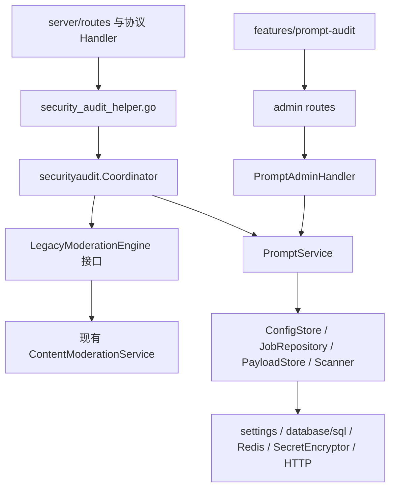
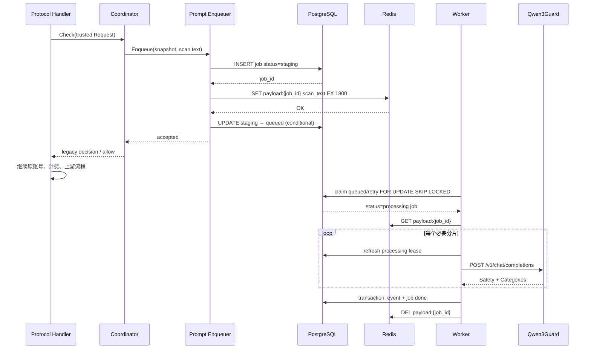
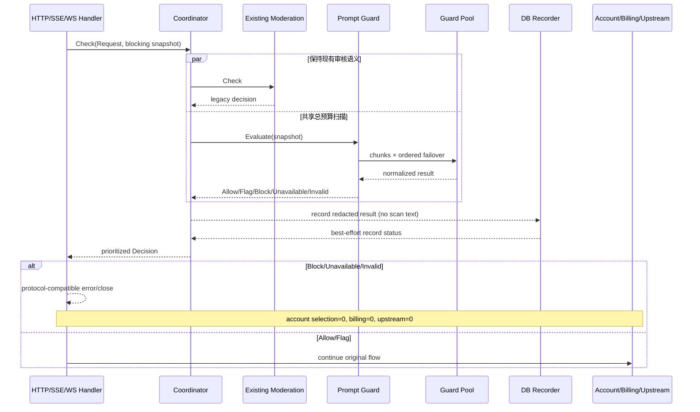
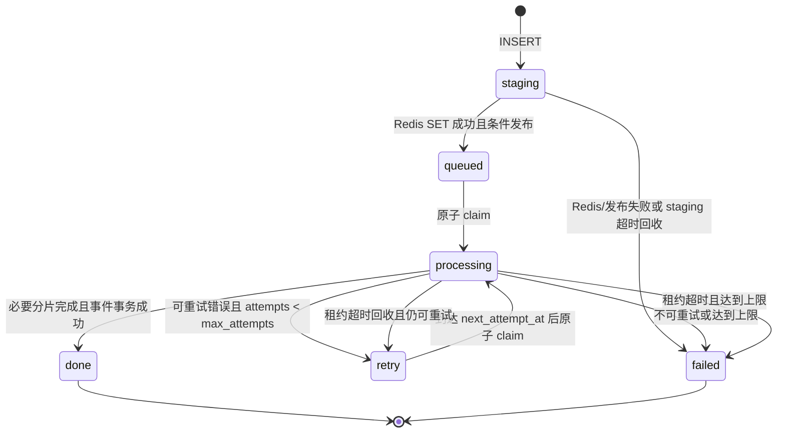

# 实施指导

## 1. 使用方式与不可变边界

本指南把 `proposal.md`、`design.md` 和三个 delta specs 转换为可按文件实施、可逐阶段评审的操作顺序。若本指南与 specs 冲突，以 specs 为准，并先更新 OpenSpec 再编码。

实施前必须满足：

- `source-baseline.md` 的冻结登记已完成，不再以变化中的源工作区作为唯一依据。
- 当前内容审核后端测试、RiskControl 前端测试和路由清单已保存为基线证据。
- 新功能的默认配置是 off；数据库迁移可以先上线，但不能自动开启审计。
- `content_moderation_logs`、`ContentModerationService`、`/admin/risk-control` 和 `RiskControlView.vue` 的业务语义不改变。
- 完整 Prompt 只允许存在于请求内存和 Redis TTL value；Guard token 只允许存在于写入 DTO、解密后的短生命周期内存和 Authorization header。

明确不做：输出审核、自动改写/脱敏后转发、人工审批、申诉、自动封号、邮件、Prompt 命中 Hash 黑名单、现有 Moderations 分类映射。

## 2. 目标依赖方向



依赖规则：

1. 现有 `internal/service` 不得 import `internal/securityaudit`；否则会把新能力反向渗入既有业务层。
2. `securityaudit` 可以通过小接口适配现有 service/repository/Redis/加密能力，但不得修改这些接口的全局语义来迁就新模块。
3. Coordinator 只归并客户端决策，不写 job/event、不发送邮件、不封号、不更新现有 Hash。
4. Handler 只负责构造可信请求、调用 Coordinator、使用本协议原有错误 helper 返回结果。
5. 核心逻辑不得读取 Gin context、环境变量或包级全局配置；这些只在模块构造/Handler 边界转换。
6. 构造函数不得启动 goroutine。Worker、回收器和配置订阅必须由 `Start(ctx)` 启动、由 `Shutdown(ctx)` 有界停止。
7. 前端只能依赖公共 DTO，不得知道 `token_ciphertext`、Redis key 或数据库内部状态转换 SQL。
8. 新模块不引入新的 ORM、队列库、状态库或 UI 框架。

## 3. 建议目录和文件职责

```text
backend/internal/securityaudit/
├── coordinator.go                 # 双引擎编排、固定优先级
├── coordinator_test.go
├── prompt_types.go                # Request/Decision/Job/Event/Runtime 与枚举
├── prompt_config.go               # Storage/Public/Update DTO、校验、快照
├── prompt_config_test.go
├── prompt_snapshot.go             # 协议提取、Hash、脱敏预览
├── prompt_snapshot_test.go
├── prompt_scanner.go              # 分片、聚合、Scanner 接口
├── prompt_qwen3guard.go            # 请求构造、严格解析、九类风险
├── prompt_qwen3guard_test.go
├── prompt_issue_summary.go         # 从分类/脱敏证据派生管理端风险摘要
├── prompt_issue_summary_test.go
├── prompt_outbound_security.go     # URL/DNS/Dial/redirect/响应上限
├── prompt_outbound_security_test.go
├── prompt_repository.go            # database/sql jobs/events 实现
├── prompt_repository_test.go
├── prompt_payload_store.go         # Redis SET EX/GET/DEL
├── prompt_enqueue.go               # staging → payload → queued
├── prompt_enqueue_test.go
├── prompt_worker.go                # claim/lease/retry/reclaim/lifecycle
├── prompt_worker_test.go
├── prompt_guard.go                 # blocking evaluator、deadline/failover/bulkhead
├── prompt_guard_test.go
├── prompt_runtime.go               # 健康、版本、队列、指标快照
├── prompt_logging.go               # 稳定事件和 allowlist fields
├── prompt_handler.go               # 独立 admin HTTP handler
├── prompt_handler_test.go
└── prompt_module.go                # provider set、Start/Shutdown 组合

backend/migrations/181_prompt_audit.sql
backend/internal/handler/security_audit_helper.go
backend/internal/server/routes/admin.go
backend/internal/server/routes/gateway.go
backend/internal/wire/或项目实际 provider 文件

frontend/src/features/prompt-audit/
├── PromptAuditView.vue
├── api.ts
├── types.ts
├── viewModel.ts
├── components/
└── __tests__/
```

`181` 是提案编写时最大迁移号后的建议值。实施时若 181 已存在，必须使用新的最大序号；不得改写已经应用的 migration。

## 4. 按文件的实施顺序

### 4.1 第一批：契约与纯函数

1. 创建 `prompt_types.go`，固定稳定枚举和 JSON 字段。
2. 创建 `prompt_config.go`，先实现默认值、三态归一、字段边界和 Public DTO。
3. 创建 `prompt_snapshot.go`，完成各协议纯文本提取、最新输入优先、SHA-256 和脱敏预览。
4. 创建 `prompt_scanner.go`、`prompt_qwen3guard.go` 与 `prompt_issue_summary.go`，完成 rune 分片、严格解析、聚合和展示摘要派生。
5. 同步创建上述测试；此阶段不连接 DB、Redis、Gin 或真实 Guard。

验收重点：纯函数表驱动测试覆盖中文、emoji、空输入、混合 content blocks、九类风险、额外说明、重复字段、未知类别和完整分片。

### 4.2 第二批：数据库与配置适配

1. 新增 `181_prompt_audit.sql` 以及 migration schema 测试。
2. 在 `prompt_repository.go` 用现有 `*sql.DB` 实现 jobs/events；不为这两张表增加 Ent schema。
3. 在目标项目现有 setting 常量事实源增加 `prompt_audit_config`。
4. 在 `prompt_config.go` 复用 `SettingRepository` 和 `SecretEncryptor`，实现 storage ↔ active ↔ public 三类 DTO 转换。
5. 在 `prompt_payload_store.go` 适配现有 Redis Client。
6. 完成 Repository、加密配置、多实例版本加载测试。

### 4.3 第三批：出站安全、异步队列与运行态

1. `prompt_outbound_security.go` 先实现保存/探测/调用共用的 URL 校验和受控 Transport。
2. `prompt_enqueue.go` 实现 staging 发布协议。
3. `prompt_worker.go` 实现 PostgreSQL claim、租约、重试、回收和生命周期。
4. `prompt_runtime.go` 汇总 active/expected config version、Worker、队列、Redis 和节点健康。
5. `prompt_logging.go` 固定事件名、error_code 和允许字段。
6. 用 fake clock、fake scanner、真实测试 PostgreSQL/Redis 分层验证，先不开网关。

### 4.4 第四批：管理 API 和控制台

1. `prompt_handler.go` 注册 config/probe/runtime/events/delete 方法。
2. 在 admin handler 聚合结构和 Wire 中注入 `PromptAdminHandler`。
3. 在 `admin.go` 注册独立 `/admin/prompt-audit` 路由组。
4. 创建前端 `features/prompt-audit` 的 types、api、viewModel，再创建页面和组件。
5. 增加 router、Sidebar、zh/en i18n 的薄接线。
6. 管理闭环通过后，Prompt Audit 仍默认 off。

### 4.5 第五批：Coordinator 与异步接入

1. 在 `coordinator.go` 用 fake engines 完成 off/async/blocking 组合测试。
2. 新增 `security_audit_helper.go`，从现有 `buildContentModerationInput` 的可信字段构造 `securityaudit.Request`。
3. 机械替换所有现有 `checkContentModeration` 调用点为 `checkSecurityAudit`，保留原位置。
4. async 模式只 best-effort 投递；Redis/DB/节点失败不得改变客户端响应或上游次数。
5. 运行路由结构测试，证明没有漏掉已有调用点。

### 4.6 第六批：同步 Guard

1. `prompt_guard.go` 实现共享 deadline、节点优先级、故障切换和 bulkhead。
2. Coordinator 接入 blocking 分支并固定现有内容审核 Block 响应优先级。
3. HTTP/SSE 使用协议原有错误构造器；Guard 完成前 SSE 不写首字节。
4. Responses WS 首轮和后续 `response.create` 分别接入，使用指定 close code。
5. 加入账号选择、并发 slot、预扣/计费、上游拨号/写入 fake counter，断言拒绝时全部为 0。

## 5. 公共核心类型建议

### 5.1 可信请求

```go
type Request struct {
    RequestID  string
    UserID     int64
    Username   string
    UserEmail  string
    APIKeyID   int64
    APIKeyName string
    GroupID    *int64
    GroupName  string
    Provider   string
    Endpoint   string
    Protocol   string
    Model      string
    Body       []byte
    Stage      string // http | first_turn | subsequent_turn
}
```

Body 必须是 Handler 在全局 body limit 下已经读取的同一字节切片。模块不得再次读 `http.Request.Body`，不得改写转发 body。`Username`、`UserEmail` 和 `APIKeyName` 只用于管理员事件快照/展示，不得进入普通请求日志；API 必须分列返回，避免复制/筛选时含义混淆。

### 5.2 统一决策

```go
type Decision struct {
    Kind           string // allow | flag | block | unavailable | invalid
    HTTPStatus     int
    ErrorCode      string
    ClientMessage  string
    Legacy         *LegacyDecision
    Prompt         *PromptDecision
    AllowNextStage bool
}
```

稳定优先级：

1. Legacy content moderation Block：完全复用原状态码、文案和 `content_policy_violation`。
2. Prompt Block：403 + `prompt_guard_blocked`。
3. Prompt Invalid：503 + `prompt_guard_invalid_response`。
4. Prompt Unavailable：503 + `prompt_guard_unavailable`。
5. 其他：Allow；Flag 只记录，不阻断。

不要让 Coordinator 暴露 Qwen 原始响应，也不要用一个布尔 `Blocked` 吞掉 unavailable/invalid 的差异。

## 6. Coordinator 请求流

```text
鉴权与 body/model 基础校验
  → 构造可信 Request
  → 读取 risk_control + prompt active snapshot
  → Coordinator 调用现有 Moderation 与 Prompt 引擎
  → 按固定优先级得到 Decision
  → 若 !AllowNextStage，使用当前协议 error helper 返回
  → 否则才进入账号选择/并发/计费/上游
```

模式行为：

| 有效模式 | 现有 Moderation | Prompt Audit | 请求等待 Prompt | Prompt 失败影响请求 |
| --- | --- | --- | --- | --- |
| off | 原行为 | 不运行 | 否 | 否 |
| async_audit | 原行为 | best-effort enqueue | 否 | 否 |
| blocking | 原行为 | 同步扫描并复用结果记录 | 是 | 是，fail-closed |

async 模式下应先触发/完成有界投递动作，再返回 Coordinator 结果，确保现有 Moderation 随后 Block 时 Prompt 事件仍可 best-effort 产生。投递动作必须只有短 DB/Redis 操作，不能等待 Guard。

blocking 模式可以并行执行两个引擎，但必须遵守：

- goroutine 数量固定且可等待，不得 fire-and-forget。
- 两个结果都在各自 deadline 内收口，或明确取消。
- Legacy Block 的响应优先，但 Prompt 结果仍按独立规则记录。
- 共享只读 Request；不得共享可变 decision buffer。

## 7. 异步时序



异常补偿：

- active count 与 staging INSERT 在 PostgreSQL advisory-lock 短事务中完成；锁超时使用 `queue_admission_busy`，不得把 Redis 调用放进事务。
- staging INSERT 失败：不写 Redis，记录 dropped，主请求继续。
- Redis SET 失败：job 条件标 failed；主请求继续。
- staging → queued 条件更新失败：删除 Redis key；回收器处理残留 staging。
- Worker 找不到 payload：按稳定 `payload_missing` 失败，不可把预览当原文扫描。
- event 写入失败：异步 job retry 或 failed，不能产生虚假 done。
- Redis DEL 失败：依靠 TTL，记录脱敏警告。

## 8. 同步阻断时序



同步记录失败不得反转已确定结果。一次同步评估只调用 Guard 一次；记录 adapter 禁止接收 `scan_text`，防止为了落库再次扫描或意外持久化原文。

## 9. Job 状态机



每次 queued/retry → processing 必须把 `claim_version` 原子加一并返回给 Worker。租约刷新、event+done 事务和 retry/failed 更新必须使用“id + processing + claim_version”条件并检查 affected rows；0 rows 表示租约已失效，本 Worker 必须丢弃结果。禁止仅按 status 条件更新，因为任务被回收并重新领取后 status 会再次变成 processing，旧 Worker 会误覆盖新结果。

## 10. 配置、Storage DTO 与 Public DTO

### 10.1 存储结构

setting key 固定为 `prompt_audit_config`，JSON 至少包含：

```text
enabled, blocking_enabled, store_pass_events,
strategy=priority, worker_count, queue_capacity,
scanners[], all_groups, group_ids[], endpoints[],
config_version, updated_at, updated_by, change_summary
```

Endpoint storage 字段：

```text
id, name, protocol=openai_compatible, base_url,
model=sileader/qwen3guard:0.6b,
token_ciphertext, timeout_ms, input_limit, enabled
```

### 10.2 写入 DTO

每个 endpoint 的写入必须区分：

- `token` 非空：校验后加密并替换旧密文。
- `token` 空且 `clear_token=false`：保留旧密文；新 endpoint 没有旧密文时校验失败。
- `clear_token=true`：清除密文；启用的 endpoint 若必须认证则保存失败或明确显示不可用。

保存请求必须携带 `expected_config_version`。后端在 PostgreSQL 短事务中取得该 setting 专用 advisory transaction lock、重读当前值并做 CAS；冲突返回 409 `prompt_audit_config_conflict`，不写 settings、不安装快照、不发 Redis 通知。`enabled=false && blocking_enabled=true` 必须返回稳定错误 `prompt_guard_requires_audit_enabled`。`strategy` 第一版只接受 `priority`。保存时 canonicalize group IDs、scanner IDs 和 endpoint IDs，拒绝重复、空 ID、越界 worker/queue/timeout/input_limit。

### 10.3 Public DTO

GET config 和 PUT 成功响应只允许：

```text
id, name, protocol, base_url, model, timeout_ms,
input_limit, enabled, has_token, token_status
```

不得出现 `token`、`token_ciphertext`、Authorization、解密失败原文或完整错误响应。后端 JSON 类型应物理分离，不能依赖 `json:"-"` 后复用内部对象。

### 10.4 活动快照

- 保存成功后 `config_version + 1`，先安装本实例只读快照，再发布 Redis invalidation。
- Pub/Sub 消息只含版本，不含配置。
- 其他实例重新从 settings 加载、解密、验证，成功后原子替换。
- 加载失败保留 last-known-good，并在 runtime 同时展示 expected/active version 和错误。
- 冷启动无 last-known-good 且 blocking 期望启用时必须 degraded/error，不能当作 off 放行。
- 请求热路径只读内存快照，不查 settings/DB。

## 11. 管理 API 映射

统一前缀：`/admin/prompt-audit`。全部复用现有管理员鉴权、安全中间件和管理操作审计。

| 方法 | 路径 | 用途 | 关键约束 |
| --- | --- | --- | --- |
| GET | `/config` | 读取公共配置 | 不回显密文/明文 token |
| PUT | `/config` | 原子保存完整配置 | 版本递增、allowlist 审计 |
| POST | `/endpoints/probe` | 测试保存或临时凭据 | 禁重定向、SSRF 防护、结果脱敏 |
| GET | `/runtime` | 运行态与指标 | 显示真实 degraded/error |
| GET | `/events` | 复合筛选分页 | 稳定排序；用户名/邮箱/API Key 名称分列 |
| GET | `/events/:id` | 事件详情 | 脱敏预览、归一结果和派生 issue_summaries |
| DELETE | `/events/:id` | 单条硬删除 | 审计、孤立 job 安全清理 |
| POST | `/events/batch-delete` | 按 ID 批量删除 | 限制 ID 数量、事务分批 |
| POST | `/events/delete-preview` | 预览筛选删除 | 强制起止时间，返回 count/max_id/hash/token |
| POST | `/events/delete-by-filter` | 确认筛选删除 | confirm=true，认证 token/actor/hash，限制 id≤max_id |

分组选择复用目标项目现有管理员 group 查询 API，不为 Prompt Audit 复制一份分组事实源。若现有 API 不适合轻量选择器，只新增薄的只读适配，并在实现前回写本表。

建议错误 envelope 继续使用项目管理 API 的统一结构；业务错误码稳定，内部 SQL/Redis/HTTP 错误不得透传。

## 12. 网关 Handler 路由矩阵

下表是提案编写时已有 `checkContentModeration` 调用点，实施时应机械替换并由结构测试锁定。路由别名共享相同 Handler，因此测试必须至少覆盖主路由与每类 alias。

| 协议/入口 | 路由 | 现有 Handler 文件/方法 | Stage | 拒绝构造器 |
| --- | --- | --- | --- | --- |
| Anthropic Messages | `POST /v1/messages` | `gateway_handler.go: Messages` 或 `openai_gateway_handler.go: Messages` | http | Anthropic error helper |
| OpenAI Responses | `POST /v1/responses`、`/responses`、`/backend-api/codex/responses` 及 subpath | `gateway_handler_responses.go: Responses` 或 `openai_gateway_handler.go: Responses` | http | Responses/OpenAI helper |
| OpenAI Chat Completions | `POST /v1/chat/completions`、`/chat/completions` | `gateway_handler_chat_completions.go: ChatCompletions` 或 `openai_chat_completions.go: ChatCompletions` | http | Chat/OpenAI helper |
| Gemini Generate/Stream | `POST /v1beta/models/*modelAction` | `gemini_v1beta_handler.go: GeminiV1BetaModels` | http | Google error helper |
| OpenAI Images | `POST /v1/images/generations`、`/v1/images/edits` | `openai_images.go: Images` | http | OpenAI helper |
| Grok image/video 文本请求 | images/videos 路由 | `grok_media.go: handleGrokMedia` | http | OpenAI helper |
| Responses WebSocket 首轮 | `GET /v1/responses`、`/responses`、`/backend-api/codex/responses` | `openai_gateway_handler.go: ResponsesWebSocket` | first_turn | close 4403/1013 |
| Responses WebSocket 后续轮次 | 每个 `response.create` | 同上 BeforeRequest/turn callback | subsequent_turn | close 4403/1013 |

实施时还必须从 `backend/internal/server/routes/gateway.go` 枚举所有携带用户文本的新增/旁路入口，重点复核：

- `/v1/images/generations/async`、`/v1/images/edits/async`。
- `/v1/images/batches` 及 batch item 的实际提交入口。
- Grok video generation/edit/extension。
- 任何不经过上述公共 Handler 的内部转发、兼容 alias 或后续新增路由。

对额外入口有两种合法结论：接入 Coordinator；或证明它已在上游公共 Handler 处检查且不会二次收费/二次扫描。结论和测试必须加入路由矩阵，不能静默跳过。

接入位置不变量：鉴权、body limit、基本 JSON/model 校验之后；账号选择、用户/账号并发 slot、订阅/余额预扣、usage 写入、上游拨号和 SSE 首字节之前。

## 13. HTTP、SSE、WebSocket 处理细节

| 情况 | HTTP/SSE | WS close | reason/code |
| --- | ---: | ---: | --- |
| Prompt Block | 403 | 4403 | `prompt_guard_blocked` |
| Guard Unavailable | 503 | 1013 | `prompt_guard_unavailable` |
| Guard Invalid response | 503 | 1013 | `prompt_guard_invalid_response` |

- HTTP/SSE 必须保留各协议 envelope，不能所有协议统一成 Gin `{"error":"..."}`。
- OpenAI Chat/Responses 在 error 对象添加稳定 `code`；Claude 保留 permission_error/api_error type 并添加可选 `code`。
- Gemini 保留数值 HTTP `error.code` 和 canonical status，只在 `google.rpc.ErrorInfo.reason` 放稳定代码；metadata 仅 request_id。
- SSE 在 Guard 结果前不得写 status/header/data/comment/keepalive；否则无法返回 403/503。
- WS 握手本身没有 Prompt，不扫描。首个 `response.create` 在任何本轮资源/上游副作用前扫描。
- 后续每个 `response.create` 重新提取本轮输入并标记 `subsequent_turn`。
- WS close reason 长度必须在协议限制内，只使用稳定短码；详细内部错误只进脱敏指标/日志。
- Legacy moderation 同时 Block 时，继续使用其原错误/close 行为和文案。

## 14. SQL 和 Repository 注意事项

### 14.1 Migration

- PostgreSQL migration 是事实源；不要复制源仓库的 `aicodex_` 前缀。
- 表名固定 `prompt_audit_jobs`、`prompt_audit_events`。
- 所有状态、计数和非负值加 CHECK；JSONB 加可接受类型检查更佳。
- `events.job_id ON DELETE CASCADE`；user/api_key/group 外键 `ON DELETE SET NULL`。
- `username_snapshot`、`user_email_snapshot`、`api_key_name_snapshot` 与 group name 快照分列保留，以免主体删除后事件无法复核；沿用现有管理员权限和数据保留策略。
- 不新增 raw_prompt、raw_request、request_body、payload、token、authorization、guard_response_body 等列。
- 索引名全库唯一；先检查 migration 事实源，避免只在开发库检查。

### 14.2 原子领取

`FOR UPDATE SKIP LOCKED` 必须在同一短事务中选择并更新为 processing。事务内不要调用 Redis、Guard 或日志网络 sink。每次 claim 后立即提交，长工作在事务外执行。

### 14.3 租约和重试

- attempts 在成功 claim 时递增，而不是失败时递增。
- 每个必要分片前刷新租约，并以 processing 状态和本次 claim_version 作为条件。
- 401/403、严格解析错误不可重试；429、5xx、连接、超时可重试。
- 建议退避 5s、30s、2m，上限 5m并加小 jitter；测试使用 fake clock。
- reclaim 批次有上限并按时间/id 稳定排序，防止全表锁和饥饿。

### 14.4 事件和任务事务

- 异步成功：event insert 与 job done 应在单事务完成。
- 同步：创建 blocking/done job 与可选 event 在单事务完成，但失败不改变门禁结果。
- store_pass_events=false 时仍可保存 done job 的最小脱敏执行记录；若最终决定不保存 Pass job，必须回写 schema、runtime 计数和清理规格。
- 删除 event 后只删除无事件引用且非 processing 的孤立 job；并 best-effort 删除 Redis key。

### 14.5 查询与删除

- 列表使用参数化 SQL、白名单排序字段和稳定 `created_at DESC, id DESC`。
- 时间过滤明确采用 UTC 存储、API ISO-8601，并定义边界包含性。
- delete-preview 在同一数据库快照得到 count 和 snapshot_max_id，对 canonical JSON filter + max_id 计算 SHA-256；字段顺序、空值和时区必须规范化。
- 使用 SecretEncryptor 认证加密 `{filter_hash,snapshot_max_id,admin_id,issued_at,expires_at}`，返回默认 5 分钟有效的 confirmation_token。
- delete-by-filter 解密并校验 actor/expiry/hash，要求同一筛选、`confirm=true` 和强制时间范围，查询强制 `id <= snapshot_max_id` 后分批提交；预览后的新事件不可被删除。

## 15. Guard Client 和出站安全

请求固定发送到规范化 `{base_url}/v1/chat/completions`，默认模型 `sileader/qwen3guard:0.6b`，role=user、temperature=0、max_tokens=64、seed=42。

保存、probe 和实际扫描必须走同一校验/Transport：

- 只允许 http/https；禁止 userinfo、query、fragment。
- 禁止 metadata、link-local、multicast、unspecified、保留地址。
- 公网强制 HTTPS；HTTP 只允许显式受控的 localhost/私网开发场景。
- DNS 解析结果和真正 Dial 的 IP 都检查，防 DNS rebinding。
- 不跟随 3xx；响应体最多 256 KiB。
- 独立连接池和 Dial/TLS/ResponseHeader timeout；所有分片/故障切换仍受外层总 deadline。
- 日志只写 endpoint ID、HTTP status、error_code、latency，不写完整 URL、query、header 或原始 response body。
- 分片日志只写 chunk_index/total/chars、input_chars/limit、endpoint ID、action、latency 和错误码，不写 chunk 或内部优先级分隔符。

九类 scanner ID/展示名必须稳定：Violent、Non-violent Illegal Acts、Sexual Content or Sexual Acts、PII、Suicide & Self-Harm、Unethical Acts、Politically Sensitive Topics、Copyright Violation、Jailbreak。

## 16. 前端状态与凭据处理

建议 viewModel 分成：

```text
serverSnapshot     # 最近一次后端公共配置
draft              # 可编辑非敏感配置
endpointSecrets    # 仅当前会话内的新增/替换 token
loadState          # config/runtime/groups/events 独立状态
probeStateByID     # 节点探测进度和脱敏结果
eventQuery         # canonical filter + page
deletePreview      # count + max_id + filter_hash + confirmation_token + filter snapshot
issueSummaries     # 后端从事件事实派生的只读风险展示项
```

规则：

- `endpointSecrets` 不进入 Pinia 持久化、localStorage、sessionStorage、URL、console 或错误追踪 breadcrumb。
- 保存成功后立即清空已提交 secret；失败时可以留在内存草稿供用户修正，但离开页面/卸载必须清空。
- 编辑已保存节点时 token 输入默认空，使用 `has_token/token_status` 表示存在性。
- “清除 API Key”使用独立明确动作设置 `clear_token=true`，不能把输入框空值当清除。
- dirty 比较忽略后端时间戳，但包含 clear/replace 意图；保存返回后以 Public DTO 重建 snapshot。
- config/runtime/groups/events 独立失败，不能一个 500 让整页白屏。
- `blocking_enabled` 从 false → true 必须二次确认；关闭 enabled 同时把 draft blocking 设 false。
- 删除预览与 filter snapshot、snapshot_max_id、confirmation_token 绑定；任何筛选变化立即废弃旧 filter_hash/token。
- 用户名、邮箱和 API Key 名称使用不同字段/复制按钮；空值显示明确 fallback，不用邮箱冒充用户名。
- IssueSummary 展示 category、title/description、severity/action、scanner、score 和脱敏 evidence，禁止从 evidence 重建命中原文。
- 窄屏表格提供可读替代布局，Dialog 有 focus trap/return focus，所有控件有中英文可访问名称。

## 17. PR/提交切片策略

每个阶段应可单独评审、测试和回滚，建议五组 PR：

1. **数据与核心契约**：migration、types/config/snapshot/Qwen parser、Repository 及测试；无路由接入。
2. **异步引擎**：出站安全、Redis payload、enqueue、Worker、runtime；功能默认 off。
3. **管理闭环**：admin API、独立页面、路由/Sidebar/i18n；仍不启用 blocking。
4. **Coordinator 与同步门禁**：统一接入、HTTP/SSE/WS、无副作用断言、Legacy 回归。
5. **灰度与运维**：指标、告警、canary 泄露检查、运行手册和阈值登记。

不要在同一 PR 混入无关的 ContentModeration 重构、全局 Handler 重写、前端框架升级或数据库清理。若为接线必须改现有文件，变更应机械、薄且有前后行为测试。

## 18. 五个待确认事项的决策门

| 事项 | 默认建议 | 必须在何时确认 | 未确认时行为 |
| --- | --- | --- | --- |
| 源基线标识 | 专用 commit/tag | PR 1 前 | 不开始移植 |
| 自动保留期 | 第一版只安全删除 | migration 冻结前 | 不加自动清理 |
| 双引擎并行/串行 | 并行 | PR 4 前做 benchmark/race | 可先串行但保留优先级 |
| 额外文本入口 | routes 自动枚举 | PR 4 接线前 | 结构测试失败 |
| blocking 阈值 | 运营按 async 数据登记 | 生产 blocking 前 | 只允许 off/async |

## 19. 常见错误

- 直接把 Qwen3Guard 加进 `ContentModerationService`，导致配置、表和副作用混用。
- 直接复制源 Ent/React/Caddy 代码，形成重复基础设施或目标项目无法维护的适配壳。
- 先把 job 设 queued 再写 Redis，造成 Worker 抢到无 payload 任务。
- 把 `redacted_preview` 当作可重试扫描正文；这会产生错误分类且破坏完整覆盖。
- 用 byte 长度切中文/emoji，或只扫描第一片后返回 Allow。
- 把 Guard 401/403/invalid_response 当 Safe 或无限切节点。
- SSE 已写 200/首字节后才运行 Guard。
- WS 只检查首轮，不检查后续 `response.create`。
- Prompt 拒绝发生在账号选择、并发 slot、预扣或上游拨号之后。
- Public DTO 复用 Storage DTO，靠前端“不显示”隐藏 token。
- 日志记录请求 body、Guard 原始响应、完整 Base URL/query 或 Redis value。
- 配置 reload 失败时清空 last-known-good，或冷启动失败时伪装为 off/healthy。
- 按筛选删除没有强制时间范围、预览 Hash 或筛选变化失效。
- 为迁移方便重命名/迁移现有 `content_moderation_logs` 或改变 `/admin/risk-control`。

## 20. Definition of Done

只有全部成立才算实现完成：

- 源 commit/tag/patch 已冻结并有可验证 SHA-256。
- 三个 specs 的每个 Requirement 都在 `verification.md` 有测试/SQL/日志/截图证据。
- Prompt Audit 默认 off；off 时所有外部协议、现有内容审核响应和副作用与升级前一致。
- async 失败不改变客户端状态、响应体、计费和上游调用次数。
- blocking 的 Block/Unavailable/Invalid 在 HTTP/SSE/WS 映射正确，且账号选择、计费、上游均为 0。
- 所有现有用户文本路由和 alias 都有 Coordinator 覆盖证据。
- 两张新表、Redis metadata、日志、API、浏览器状态和截图均未出现 canary Prompt/token。
- 风险详情拥有确定性 issue_summaries，用户名/邮箱/API Key 名称可分别复核复制，逐分片日志只含安全元数据。
- 多 Worker、多实例配置失效、租约回收和 graceful shutdown 测试通过。
- 原 RiskControl 页面、关键词、Hash、邮件、自动封号和内容审核记录回归通过。
- 后端 unit/race/integration、前端 lint/typecheck/Vitest、生产 build 和 OpenSpec strict validate 全部通过。
- 已完成 async 灰度观测；blocking 阈值、告警、值班步骤和一键回滚已由责任人签字确认。
